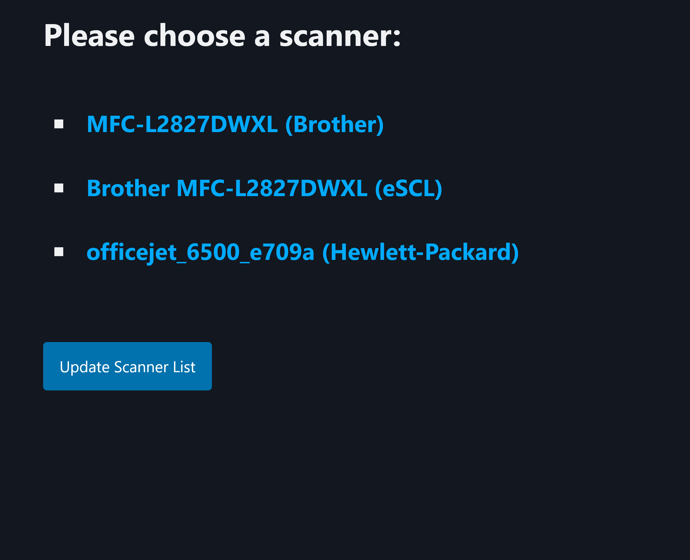

# A simple web application for scanning
This is a simple scanning application to create PDF files using the SANE-backend.
It allows to scan double-sided pages using single-side ADF scanners - just insert the paper stack again rotated by 180°
(so the top of the first page points down and towards the document feed) and press the button to add the backside(s).
This also works with flatbed scanners for single double-sided pages (front- and backside create one file).

This application is written in Python using fastapi, pydantic and pysane and uses HTMX and pico.css to handle the client-side.

## A short introduction with some screenshots
The main page lists the scanners detected by SANE (should be the same list as generated by `scanimage -L`). If a scanner is recognized by multiple drivers (in the following example the Brother MFC-L2827DWXL is available using both the proprietary and the [`sane-airscan`](https://github.com/alexpevzner/sane-airscan) drivers), it will  shown up multiple times:

If you switched on your scanner later than the daemon, you can manually update the list of scanners (which will take a couple of seconds).

Once you selected a scanner, you can choose the resolution, the scan mode (color/greyscale/black and white) and the source (choose flatbed or ADF - note that using the "Auto" option will only scan a single page). You can optionally set a filename for the scan, otherwise the scan will be named with the time of the scan, e.g. `Scan_2025-02-13_18_37_23.pdf`:

While the scan is executed, you will see this progress screen:

After the scan has been completed, you can choose to scan the backside(s):

Choose "Done" to end processing the current scan without adding the backsides. After the operation is completed, you will see the Options for the selected scanner again.

## Installation
You need Python3 (with the capability to create virtual environments), the ability to build C programs and the header files of libsane - on a Ubuntu 24.04 machine this would require installing the following packages:
```shell
sudo apt install python3-venv libsane-dev build-essential
```
After that you can clone the git repository, create a virtual environment and install the required python modules:
```
git clone https://seahawk1986/simple-web-scan/
cd simple-web-scan
python3 -m venv .venv
. .venv/bin/activate
pip install -U pip wheel
pip install -r requirements
```

## Configuration
Change the variable `config` in `src/config.py` to set the scan directory (defaults to `/srv/files/Scans`) and the default options for scanner resolution (`300` dpi), source (`"ADF"`) and color mode (`"Gray"`).

## Running the programm
You can start the program by calling `./run.sh`. This file also allows to customize the network options. By default it will listen to any client (`--host=0.0.0.0`) on port `8000`.

For productive use it might be helpful to run it behind a reverse proxy like nginx.